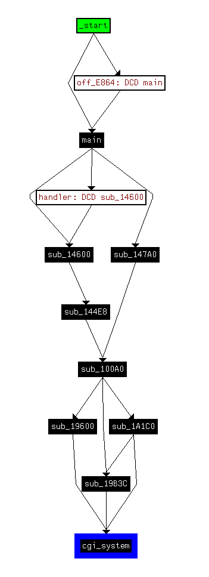

## Description

NETGEAR is aware of the security issue [#582384](http://kb.netgear.com/000036386/CVE-2016-582384?cid=wmt_netgear_organic) that allows unauthenticated web pages to pass form input directly to the command-line interface. A remote attacker can potentially inject arbitrary commands which are then executed by the system.

## Analysis

If you want more, please extract the [vuln firmware](./CVE-2016-6277_Netgear-R7000-V1.0.7.2_1.1.93.chk), and analysis it with IDA. The parameter is passed into **cgi_system**, and executed by os **system** command. Please view the execution structure and **cgi_system** code created by IDA.




```
int __fastcall cgi_system(const char *datatofile_argv, int socket_argv, const char *url_argv, int method_argv)
{
  const char *datatofile; // r9@1
  int socket; // r11@1
  const char *url; // r6@1
  int method; // r5@1
  __pid_t processID; // r0@1
  int processID_v9; // r4@1
  int processID_v10; // r0@3
  FILE *fopen__tmp_var_readydropd; // r0@6
  char *cgi_bin_PTR; // r7@10
  char *cgi_bin_?_PTR; // r4@16
  char *slash_PTR; // r7@20
  int *buff_PTR_v15; // r6@21
  const char *print_format_v16; // r0@22
  signed int print_val_v17; // r2@22
  const char *print_v18; // r1@22
  char *strstr_ret_v19; // r0@25
  const char *v20; // r10@25
  char *v21; // r6@25
  char *v22; // r4@25
  char v23; // r3@25
  bool v24; // zf@27
  int v25; // r4@36
  const char *http_method; // r1@41
  char *http_method_buffer; // r0@41
  char *v28; // r0@52
  char *v29; // r0@54
  char *v30; // r0@56
  FILE *fopen_tmp_post_result_v31; // r0@60
  FILE *fopen_tmp_post_data.txt; // r4@63
  const char *command_format_v33; // r1@65
  char *command_buff_v34; // r0@65
  FILE *fopen_tmp_options_result_v35; // r0@67
  FILE *fopen_tmp_cgi_result_v36; // r0@71
  const char *filename2; // r0@78
  FILE *fopen_filename2; // r4@82
  char *strstr_ret_v39; // r0@87
  char *v40; // r0@88
  size_t length; // r0@98
  int http_buffer; // [sp+Ch] [bp-2052Ch]@92
  int v44; // [sp+1000Ch] [bp-1052Ch]@87
  int command_buff_PTR_v45; // [sp+2000Ch] [bp-52Ch]@65
  int v46; // [sp+2020Ch] [bp-32Ch]@32
  int QUERY_STRING_val; // [sp+2030Ch] [bp-22Ch]@18
  int buff_ptr_v48; // [sp+2040Ch] [bp-12Ch]@75
  int buff_ptr_v49; // [sp+2044Ch] [bp-ECh]@75
  int buff_PTR_v50; // [sp+2048Ch] [bp-ACh]@21
  int buff_ptr_v51; // [sp+204CCh] [bp-6Ch]@75
  int buff_ptr_v52; // [sp+204ECh] [bp-4Ch]@75
  int buff_ptr_v53; // [sp+204FCh] [bp-3Ch]@41
  int v54; // [sp+2050Ch] [bp-2Ch]@103

  datatofile = datatofile_argv;
  socket = socket_argv;
  url = url_argv;
  method = method_argv;
  processID = fork();
  processID_v9 = processID;
  if ( !processID )
  {
    if ( fork() )
    {
      processID_v10 = processID_v9;
      goto fork__exit;
    }
    if ( acosNvramConfig_match("ntgr_cgi_debug_msg", "1") )
      printf("\r\n###############%s(%d)url=%s,method=%d\r\n", "netgear_commonCgi", 59, url, method);
    fopen__tmp_var_readydropd = fopen("/tmp/var/readydropd.conf", "r");
    if ( fopen__tmp_var_readydropd )
    {
      fclose(fopen__tmp_var_readydropd);
    }
    else
    {
      system("cp -f /www/cgi-bin/readydropd.conf /tmp/var/");
      if ( acosNvramConfig_match("ntgr_cgi_debug_msg", "1") )
        puts("\r\n###################copy readydropd.conf\r");
    }
    cgi_bin_PTR = strstr(url, "cgi-bin");
    if ( cgi_bin_PTR )
    {
      if ( acosNvramConfig_match("ntgr_cgi_debug_msg", "1") )
        printf("\r\n##########%s(%d)\r\n", "netgear_commonCgi", 76);
      if ( strchr(cgi_bin_PTR, '?') )
      {
        if ( acosNvramConfig_match("ntgr_cgi_debug_msg", "1") )
          printf("\r\n##########%s(%d)\r\n", "netgear_commonCgi", 80);
        cgi_bin_?_PTR = strchr(cgi_bin_PTR, '?');
        if ( acosNvramConfig_match("ntgr_cgi_debug_msg", "1") )
          printf("\r\n#############%s(%d)tmp1=%s,tmp2=%s\r\n", "netgear_commonCgi", 83, cgi_bin_PTR, cgi_bin_?_PTR + 1);
        strcpy((char *)&QUERY_STRING_val, cgi_bin_?_PTR + 1);
        if ( acosNvramConfig_match("ntgr_cgi_debug_msg", "2") )
          printf("\r\n###############%s(%d)query_string=%s\r\n", "netgear_commonCgi", 86, &QUERY_STRING_val);
        slash_PTR = strchr(url, '/');
        if ( slash_PTR )
        {
          buff_PTR_v15 = &buff_PTR_v50;
          memset(&buff_PTR_v50, 0, 64u);
          strncpy((char *)&buff_PTR_v50, slash_PTR + 1, cgi_bin_?_PTR - 1 - slash_PTR);
          if ( acosNvramConfig_match("ntgr_cgi_debug_msg", "2") )
          {
            print_format_v16 = "\r\n###############%s(%d)cgi_name=%s\r\n";
            print_val_v17 = 93;
            print_v18 = "netgear_commonCgi";
Jump___goto_check_httpmethod:
            printf(print_format_v16, print_v18, print_val_v17, buff_PTR_v15);
            goto check_httpmethod;
          }
        }
      }
      else
      {
        if ( acosNvramConfig_match("ntgr_cgi_debug_msg", "2") )
          printf("\r\n##########%s(%d)\r\n", "netgear_commonCgi", 99);
        strstr_ret_v19 = strchr(cgi_bin_PTR, '/');
        v20 = strstr_ret_v19 + 1;
        v21 = strstr_ret_v19;
        v22 = strchr(strstr_ret_v19 + 1, '/');
        memset(&buff_PTR_v50, 0, 64u);
        v23 = (char)v21;
        if ( v21 )
          v23 = 1;
        v24 = v22 == 0;
        if ( v22 )
          v24 = v21 == 0;
        if ( v24 )
        {
          if ( v22 )
            v25 = 0;
          else
            v25 = v23 & 1;
          if ( v25 )
            strcpy((char *)&buff_PTR_v50, v20);
        }
        else
        {
          strncpy((char *)&buff_PTR_v50, v20, v22 - 1 - v21);
          if ( acosNvramConfig_match("ntgr_cgi_debug_msg", "2") )
            printf("\r\n#############tmp1=%s,tmp2=%s,tmp3=%s,cgi=%s\r\n", cgi_bin_PTR, v21, v22, &buff_PTR_v50);
          buff_PTR_v15 = &v46;
          strcpy((char *)&v46, v22);
          if ( acosNvramConfig_match("ntgr_cgi_debug_msg", "2") )
          {
            print_format_v16 = "\r\n###############%s(%d)path_info=%s\r\n";
            print_val_v17 = 110;
            print_v18 = "netgear_commonCgi";
            goto Jump___goto_check_httpmethod;
          }
        }
      }
    }
check_httpmethod:
    if ( method )
    {
      if ( method == 1 )
      {
        http_method = "POST";
        http_method_buffer = (char *)&buff_ptr_v53;
      }
      else
      {
        if ( method != 2 )
        {
LABEL_47:
          if ( acosNvramConfig_match("ntgr_cgi_debug_msg", "2") )
            printf("\r\n###############%s(%d)request_method=%s\r\n", "netgear_commonCgi", 130, &buff_ptr_v53);
          if ( (_BYTE)v46 )
            setenv("PATH_INFO", (const char *)&v46, 1);
          if ( acosNvramConfig_match("ntgr_cgi_debug_msg", "2") )
          {
            v28 = getenv("PATH_INFO");
            printf("\r\n###############%s(%d)PATH_INFO=%s\r\n", "netgear_commonCgi", 136, v28);
          }
          setenv("LD_LIBRARY_PATH", "/usr/lib", 1);
          if ( acosNvramConfig_match("ntgr_cgi_debug_msg", "2") )
          {
            v29 = getenv("LD_LIBRARY_PATH");
            printf("\r\n###############%s(%d)LD_LIBRARY_PATH=%s\r\n", "netgear_commonCgi", 140, v29);
          }
          setenv("REQUEST_METHOD", (const char *)&buff_ptr_v53, 1);
          if ( acosNvramConfig_match("ntgr_cgi_debug_msg", "2") )
          {
            v30 = getenv("REQUEST_METHOD");
            printf("\r\n###############%s(%d)REQUEST_METHOD=%s\r\n", "netgear_commonCgi", 144, v30);
          }
          if ( (_BYTE)QUERY_STRING_val )
            setenv("QUERY_STRING", (const char *)&QUERY_STRING_val, 1);
          if ( !strcmp((const char *)&buff_ptr_v53, "POST") )
          {
            fopen_tmp_post_result_v31 = fopen("/tmp/post_result", "r");
            if ( fopen_tmp_post_result_v31 )
            {
              fclose(fopen_tmp_post_result_v31);
              system("rm -f /tmp/post_result");
              if ( acosNvramConfig_match("ntgr_cgi_debug_msg", "2") )
                puts("\r\n##########del post ############\r");
            }
            system("rm -f /tmp/post_data.txt");
            sleep(1u);
            fopen_tmp_post_data.txt = fopen("/tmp/post_data.txt", "w");
            if ( fopen_tmp_post_data.txt )
            {
              fputs(datatofile, fopen_tmp_post_data.txt);
              fclose(fopen_tmp_post_data.txt);
            }
            command_format_v33 = "/www/cgi-bin/%s > /tmp/post_result < /tmp/post_data.txt";
            command_buff_v34 = (char *)&command_buff_PTR_v45;
          }
          else if ( !strcmp((const char *)&buff_ptr_v53, "OPTIONS") )
          {
            fopen_tmp_options_result_v35 = fopen("/tmp/options_result", "r");
            if ( fopen_tmp_options_result_v35 )
            {
              fclose(fopen_tmp_options_result_v35);
              system("rm -f /tmp/options_result");
              if ( acosNvramConfig_match("ntgr_cgi_debug_msg", "2") )
                puts("\r\n##########del option ############\r");
            }
            command_format_v33 = "/www/cgi-bin/%s > /tmp/options_result";
            command_buff_v34 = (char *)&command_buff_PTR_v45;
          }
          else
          {
            fopen_tmp_cgi_result_v36 = fopen("/tmp/cgi_result", "r");
            if ( fopen_tmp_cgi_result_v36 )
            {
              fclose(fopen_tmp_cgi_result_v36);
              system("rm -f /tmp/cgi_result");
              if ( acosNvramConfig_match("ntgr_cgi_debug_msg", "2") )
                puts("\r\n##########delete /tmp/cgi_result ############\r");
            }
            command_format_v33 = "/www/cgi-bin/%s > /tmp/cgi_result";
            command_buff_v34 = (char *)&command_buff_PTR_v45;
          }
          sprintf(command_buff_v34, command_format_v33, &buff_PTR_v50);
          system((const char *)&command_buff_PTR_v45);
          memset(&buff_ptr_v49, 0, 0x40u);
          memset(&buff_ptr_v48, 0, 0x40u);
          memset(&buff_ptr_v51, 0, 0x20u);
          memset(&buff_ptr_v52, 0, 0x10u);
          if ( acosNvramConfig_match("ntgr_cgi_debug_msg", "1") )
            printf("\r\n###############%s(%d)\r\n", "netgear_commonCgi", 200);
          if ( !strcmp((const char *)&buff_ptr_v53, "POST") )
          {
            filename2 = "/tmp/post_result";
          }
          else if ( !strcmp((const char *)&buff_ptr_v53, "OPTIONS") )
          {
            filename2 = "/tmp/options_result";
          }
          else
          {
            filename2 = "/tmp/cgi_result";
          }
          fopen_filename2 = fopen(filename2, "r");
          if ( fopen_filename2 )
          {
            if ( acosNvramConfig_match("ntgr_cgi_debug_msg", "1") )
              printf("\r\n###############%s(%d)\r\n", "netgear_commonCgi", 211);
            while ( fgets((char *)&v44, 0xFFFF, fopen_filename2) )
            {
              if ( acosNvramConfig_match("ntgr_cgi_debug_msg", "1") )
                printf("\r\n###############%s(%d)\r\n", "netgear_commonCgi", 215);
              strstr_ret_v39 = strstr((const char *)&v44, "Status:");
              if ( strstr_ret_v39 )
              {
                strcpy((char *)&buff_ptr_v49, strstr_ret_v39 + 7);
                v40 = strchr((const char *)&buff_ptr_v49, 10);
                if ( v40 )
                  *v40 = 0;
                if ( acosNvramConfig_match("ntgr_cgi_debug_msg", "2") )
                  printf("\r\n###############%s(%d)status=%s\r\n", "netgear_commonCgi", 223, &buff_ptr_v49);
                sprintf((char *)&http_buffer, "HTTP/1.1%s\r\n", &buff_ptr_v49);
              }
              else
              {
                strcat((char *)&http_buffer, (const char *)&v44);
              }
            }
            fclose(fopen_filename2);
          }
          strcat((char *)&http_buffer, "\r\n");
          if ( acosNvramConfig_match("ntgr_cgi_debug_msg", "1") )
            printf("\r\n###############%s(%d)http_hdr=%s\r\n", "netgear_commonCgi", 276, &http_buffer);
          length = strlen((const char *)&http_buffer);
          ssl_send_(socket, &http_buffer, length);
          if ( acosNvramConfig_match("ntgr_cgi_debug_msg", "2") )
            printf("\r\n######======######%s(%d)\r\n", "netgear_commonCgi", 280);
          processID_v10 = 0;
fork__exit:
          exit(processID_v10);
        }
        http_method = "OPTIONS";
        http_method_buffer = (char *)&buff_ptr_v53;
      }
    }
    else
    {
      http_method = "GET";
      http_method_buffer = (char *)&buff_ptr_v53;
    }
    strcpy(http_method_buffer, http_method);
    goto LABEL_47;
  }
  if ( processID > 0 )
    waitpid(processID, &v54, 0);
  return 0;
}
```

## References

1. http://kb.netgear.com/000036386/CVE-2016-582384
2. https://web.nvd.nist.gov/view/vuln/detail?vulnId=CVE-2016-6277
3. https://github.com/rapid7/metasploit-framework/issues/7698
